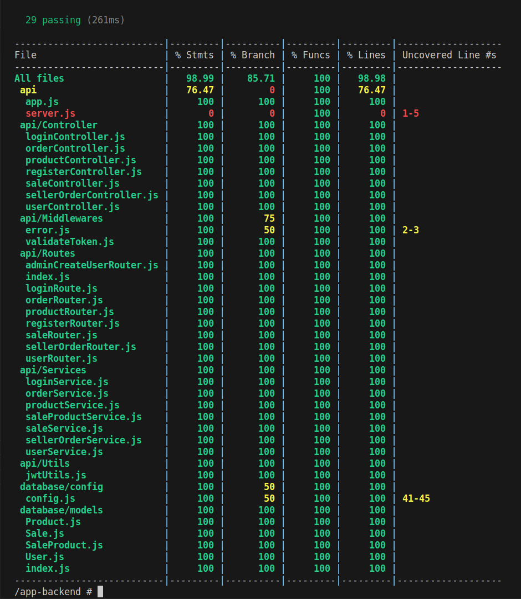
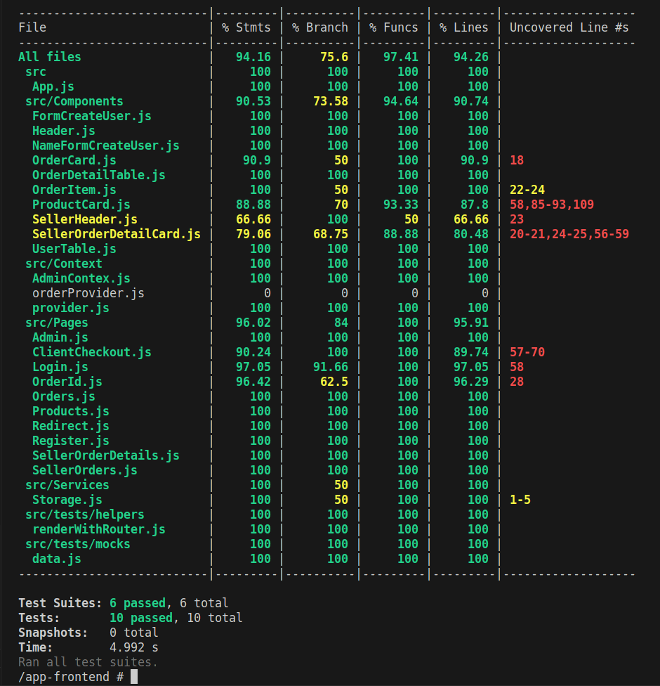

<h1 align="center">Boas-vindas ao repositório do Delivery App!</h1>
<h2 align="center">A estilização desse projeto está pendente!</h2>

## Objetivo

O <strong>Delivery App</strong> é uma aplicação full stack, que tem como objetivo realizar o gerenciamento de um delivery de bebidas!
É possível fazer login com três diferentes usuários (Admin, Seller e Customer), cada um atribuições e telas diferentes. Esse projeto foi desenvolvido durante meu período de estudante da Trybe, em um grupo de 5 pessoas. Ao todo foram 44 requisitos obrigatórios e opcionais, com aprovação em 100%.

## O que foi desenvolvido?

O back end foi construído em Node.js, com Javascript, usamos o framework Express.js para tratar do gerenciamento das rotas, JWT para auxiliar na autenticação e criptografia de dados sensíveis. O banco de dados escolhido foi o MySQL, dando a possibilidade de criar relacionamento entre as tabelas, e utilizamos o ORM sequelize
para a criação e população das tabelas e garantir a abstração das chamadas ao banco de dados. A organização de pastas foi feita usando o modelo MSC (Model, Service e Controller). Os testes de integração atingiram uma taxa de cobertura de 85%, foi utilizada as bibiotecas Mocha, Chai e Sinon para a sua escrita.

O front end foi desenvolvido com React e Javascript, para controlar o estado global fizemos uso do Context API juntamente com os React Hooks.
Para fazer as chamadas aos endpoints utilizamos a biblioteca Axios. Os testes atingiram uma cobertura de aproximamente 75% e foram feitas com a ajuda do React Testing Library.

Usamos contâineres Docker para rodar a aplicação, dois contâineres com o node.js, um responsável pelo back end, e outro responsável pelo front end, e um outro contâiner para rodar o banco de dados MySQL. Para o versionamento do código foi utilizada o Git.

## Desafios e aprendizados

Este projeto full stack foi desenvolvido em um grupo de 5 pessoas, e foi o maior projeto dos 38 que realizei durante meu período de estudante na Trybe. Na minha visão a maior dificuldade não foi a parte técnica, mas sim fazer a gestão da organização. Por se tratar de uma aplicação com várias pastas e arquivos, e além disso 5 integrantes desenvolvendo o mesmo projeto, várias vezes nos deparávamos com conflitos entre as branchs, e escrita de códigos repetidos. A separação de requisitos entre os integrantes também foi um obstáculo, pois foi necessário bastante planejamento para que conseguíssemos avançar sem depender de funcionalidades atribuídas a outros membros do time. Esse projeto foi muito útil para termos uma visão de como é feito o planejamento de um projeto mais complexo e foi ótimo para avaliarmos nossas habilidades comportamentais. Para ajudar na organização e planejamento fizemos uso de quadro Kanban para atualização e separação das tasks, e reuniões diárias no zoom para definir metas e alinhar expectativas, para a comunicação assíncrona o Slack nos ajudou.

## Minha participação

No íncio do projeto, de modo conjunto realizamos as configurações mais básicas, como: conexão com banco de dados, construção de tabelas, (Models, Migrations e Seeders) e a organização de pastas seguindo o modelo MSC. Fui responsável pela escrita de vários endpoints e rotas, passando por todas as camadas até a chamada no banco de dados, desenvolvimento de regras de negócio e autenticação e validações das informações fornecidas através do front end.
No front end, tive participação na criação de vários componentes, mais expecificamente na página de seleção e visualização de produtos, e toda a lógica que envolve a adição ou remoção das bebidas ao carrinho.
Fui responsável também por escrever todos os testes, tanto na parte do back end, como na parte de front end. Me considerei bastante participativo auxiliando os outros colegas, sempre dando sugestões e diferentes pontos de vista de como superar as dificuldades além de sempre oferecer ajuda quando julgava ser necessário, e os colegas todas as vezes retribuíram da mesma forma.

## Linguagens e ferramentas:
- Docker
- Node.js
- React
- Javascript
- Express.js
- JWT
- MySQL
- Sequelize
- React Testing Library
- Mocha
- Chai
- Sinon

## Instalação e execução com Docker:

### 1 - Clone o repositório:
```
git clone git@github.com:h3zord/delivery-app.git
```

### 2 - Entre no repositório:
```
cd delivery-app
```

### 3 - Inicie os containers:
```
docker compose up -d
```

<strong>O container app_frontend vai executar o node na porta 3000, o container app_backend na porta 3001 e o banco de dados na porta 3306.</strong>
<br/>
➜ http://localhost:3000/
<br/>
➜ http://localhost:3001/

<br/>

## Dados para login:

### Login como ADMIN
```
Email: adm@deliveryapp.com
Password: --adm2@21!!--
```

### Login como SELLER
```
Email: fulana@deliveryapp.com
Password: fulana@123
```

### Login como CUSTOMER
```
Email: zebirita@email.com
Password: $#zebirita#$
```

<br />

## Execução dos testes

### 1 - Entre no container do node back-end:
```
docker exec -it app_backend sh
```
### 2 - Rode o script:
```
npm run test:coverage
```
### 3 - Entre no container do node front-end:
```
docker exec -it app_frontend sh
```
### 4 - Rode o script:
```
npm run test:coverage
```

<br />

<h2 align="center">Cobertura de testes</h2>
<br />

<div align="center">
  
   
</div>
<br />
